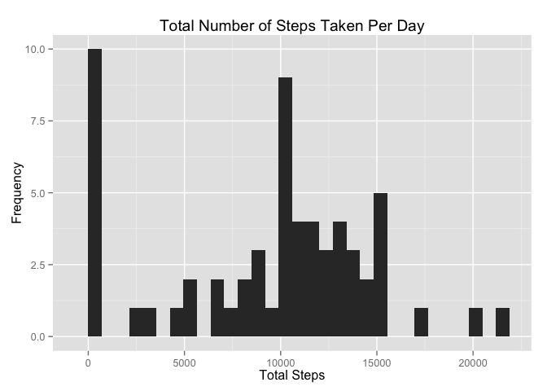
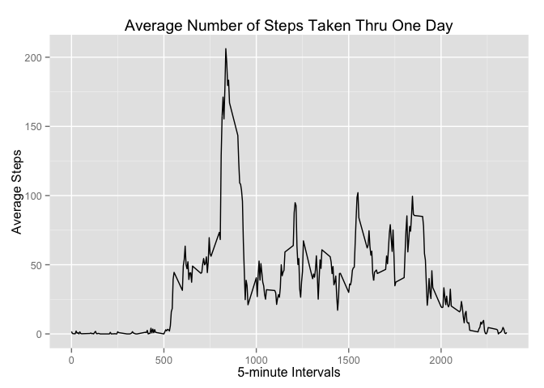
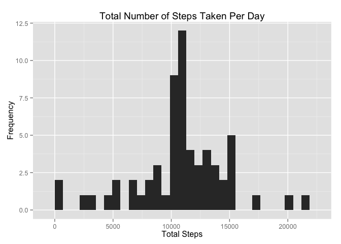
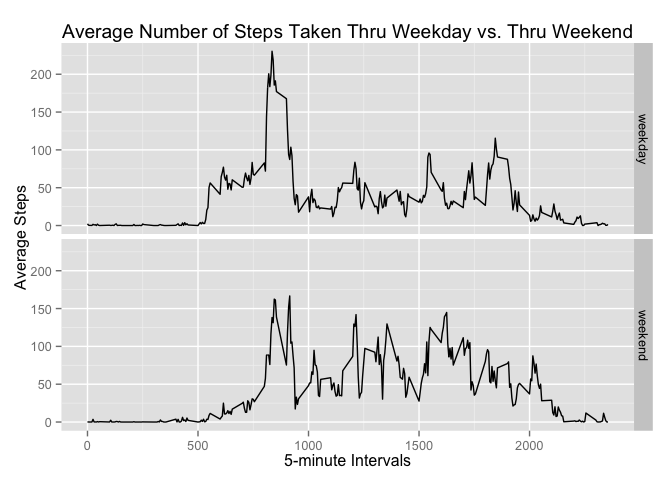

# Reproducible Research: Peer Assessment 1

```r
library("ggplot2")
```


## Loading and preprocessing the data


```r
# loading
activity <- read.csv("~/Downloads/RepData_PeerAssessment1/activity.csv")

# preprocessing
activity$date <- as.Date(activity$date, "%Y-%m-%d")
```


## What is mean total number of steps taken per day?


```r
# total number of steps taken per day
totalStepsDaily <- as.data.frame(tapply(activity$steps, activity$date, sum, na.rm = TRUE))

# histogram of the total number of steps taken per day
histogram <- ggplot(totalStepsDaily, aes(x = tapply(activity$steps, activity$date, sum, na.rm = TRUE))) + geom_histogram() + labs(title = "Total Number of Steps Taken Per Day") + labs(x = "Total Steps") + labs(y = "Frequency")
histogram
```

 

```r
# mean and median of the total number of steps taken per day
summary(totalStepsDaily)
```

```
##  tapply(activity$steps, activity$date, sum, na.rm = TRUE)
##  Min.   :    0                                           
##  1st Qu.: 6778                                           
##  Median :10395                                           
##  Mean   : 9354                                           
##  3rd Qu.:12811                                           
##  Max.   :21194
```


## What is the average daily activity pattern?


```r
# time series plot of the 5-minute interval and the average number of steps taken, averaged across all days
activity2 <- as.data.frame(activity[1:288, 3])

activity2$steps <- tapply(activity$steps, activity$interval, mean, na.rm = TRUE)

names(activity2)[1] = "interval"

timeSeriesPlot <- ggplot(activity2, aes(interval, steps)) + geom_line() + labs(title = "Average Number of Steps Taken Thru One Day") + labs(x = "5-minute Intervals") + labs(y = "Average Steps")
timeSeriesPlot
```

 

### Which 5-minute interval, on average across all the days in the dataset, contains the maximum number of steps?

```r
# 5-minute interval, on average across all the days in the dataset, containing the maximum number of steps
intervalUpperBound <- activity2[which.max(activity2$steps), 1]
intervalLowerBound <- activity2[(which.max(activity2$steps) - 1), 1]
```
830 to 835


## Imputing missing values


```r
# total number of missing values in the dataset (i.e. the total number of rows with NAs)
sum(is.na(activity))
```

```
## [1] 2304
```

```r
# strategy for filling in all of the missing values in the dataset: the mean for that 5-minute interval

# new dataset that is equal to the original dataset but with the missing data filled in
activity3 <- activity

for (i in 1:17568) {
    steps <- activity3[i, 1];
    interval <- activity3[i, 3];
    if (is.na(steps)) {
       activity3[i, 1] <- activity2[activity2$interval == interval, 2];
    }
}

# histogram of the total number of steps taken per day
totalStepsDaily2 <- as.data.frame(tapply(activity3$steps, activity3$date, sum))

histogram2 <- ggplot(totalStepsDaily2, aes(x = tapply(activity3$steps, activity3$date, sum))) + geom_histogram() + labs(title = "Total Number of Steps Taken Per Day") + labs(x = "Total Steps") + labs(y = "Frequency")
histogram2
```

 

```r
# mean and median of the total number of steps taken per day
summary(totalStepsDaily2)
```

```
##  tapply(activity3$steps, activity3$date, sum)
##  Min.   :   41                               
##  1st Qu.: 9819                               
##  Median :10766                               
##  Mean   :10766                               
##  3rd Qu.:12811                               
##  Max.   :21194
```
### Do these values differ from the estimates from the first part of the assignment?
Yes.

### What is the impact of imputing missing data on the estimates of the total daily number of steps?
The median is now approximate, if not equal, to the mean which is greater than before the imputation.


## Are there differences in activity patterns between weekdays and weekends?


```r
# New factor variable in the dataset with two levels – “weekday” and “weekend” indicating whether a given date is a weekday or weekend day
activity3$day <- sapply(activity3$date, weekdays)

for (i in 1:17568) {
    day <- activity3[i, 4];
    if (day == "Saturday" | day == "Sunday") {
       activity3[i, 4] <- "weekend";
    }
    else {
        activity3[i, 4] <- "weekday";
    }
}

activity3$day <- as.factor(activity3$day)

# Panel plot containing a time series plot of the 5-minute interval and the average number of steps taken, averaged across all weekday days or weekend days
activityWeekdays <- activity3[activity3$day == "weekday", ]
activityWeekend <- activity3[activity3$day == "weekend", ]

activityWeekdays2 <- as.data.frame(activityWeekdays[1:288, 3:4])
activityWeekend2 <-as.data.frame(activityWeekend[1:288, 3:4])

activityWeekdays2$steps <- tapply(activityWeekdays$steps, activityWeekdays$interval, mean)
activityWeekend2$steps <- tapply(activityWeekend$steps, activityWeekend$interval, mean)

names(activityWeekdays2)[1] = "interval"
names(activityWeekend2)[1] = "interval"

activity4 <- rbind(activityWeekdays2, activityWeekend2)

panelPlot <- ggplot(activity4, aes(interval, steps)) + geom_line() + facet_grid(day~ .) + labs(title = "Average Number of Steps Taken Thru Weekday vs. Thru Weekend") + labs(x = "5-minute Intervals") + labs(y = "Average Steps")
panelPlot
```

 
